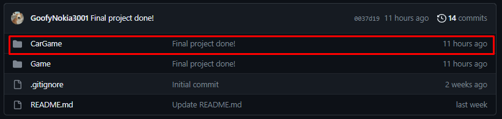

# DragNDrop_2PT2
DragNDrop Functional. Game goal is to put vehicles in right position with right size and rotation.

## Car  Game
### .exe files located here:

### And Unity files located here:

## Completed To Do List:
- [x] Option to drag objects
- [x] Option to drop object in free space
- [x] Option to drop object in wrong place
- [x] Option to drop object in right place
- [x] Change object rotation with Z
- [x] Change object width with X
- [x] Change object hight with Y
- [x] Audio effects
